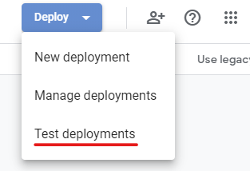
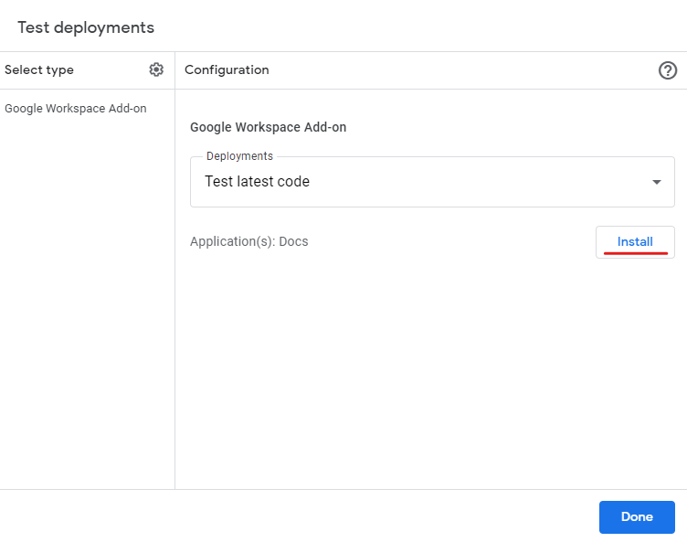
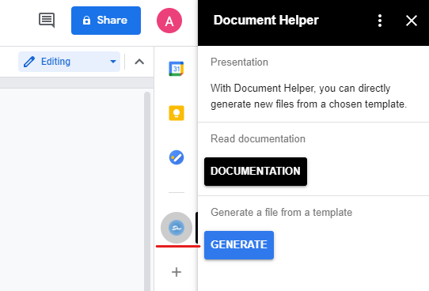

# Document_Helper

This is a small Add-On for Google Docs, allowing you to generate new documents directly from a chosen template.

I tried to publish this add-on, however as I don't have a *domain*, I couldn't manage to do it properly.

I will then explain how to deploy it as easily as possible in a test version.

## Stack

- Google AppsScript
- Pure JavaScript
- JQuery
- HTML

## How to deploy Add-On in test mode ?

### Clone the repository

First, clone this repository with Git 

---
### Installation of *clasp*

In a command line terminal, type `npm install -g @google/clasp`

---
### Enable APPs Script API

Go to https://script.google.com/home/usersettings. 
Click on the *Google AppsScript API* button.
You can now set this feature to **ON**.

---
### Create Script

In root folder of the project, type `clasp login`

Once logged in, go to src folder.

Then type `clasp create --title "Document Helper" --type standalone`

Once created, type `clasp push`

Now you can type `clasp deploy` in order to make the deployment.

---
### Install Add-on as test

Once you've made all this, you can now deploy the add-on as test.

Open your script in Google Apps Script (it should be in the Google Drive root folder).

On the top right of the window, you can click on Deploy => Test deployments.

You can now install it as a deployment install by clicking on Install.

---
### Disconnecting

Once finished, in the console, type `clasp logout`

---
### Everything should be working fine now !

You can use the Add-On by clicking on the small logo Docs, on the right of your Google Docs window.

## More Documentation

- Importing and Export Projects : https://developers.google.com/apps-script/guides/import-export
- Clasp documentation : https://github.com/google/clasp
- Enable the Google Picker API : https://developers.google.com/picker/docs